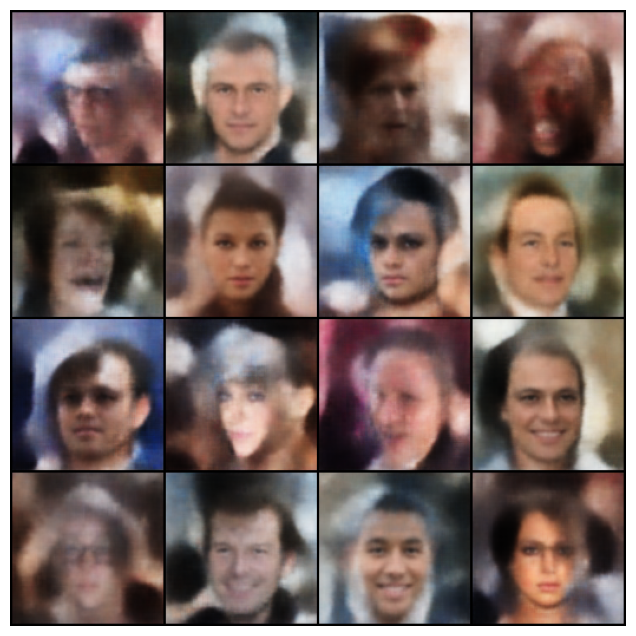

# Media generation

### VAEs

The weights are stored in FP16 due to size limitations on GitHub - halved from FP32 which is the default. The main script
has a `short_run` option to test out pipeline changes by running for one epoch.

Result after training on "flwrlabs/celeba" from HuggingFace for 20 epochs: 

For comparison, here are the samples from a run after just 1 epoch: 

Clearly needs more training

### GANs (...)

### Diffusion (...)