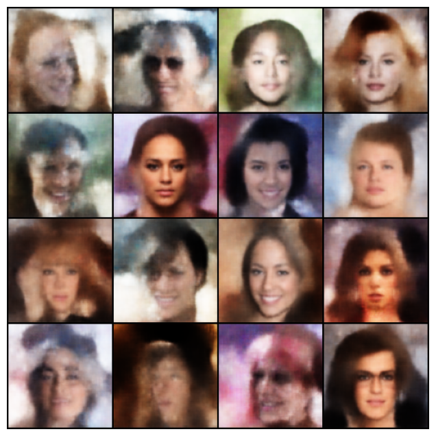
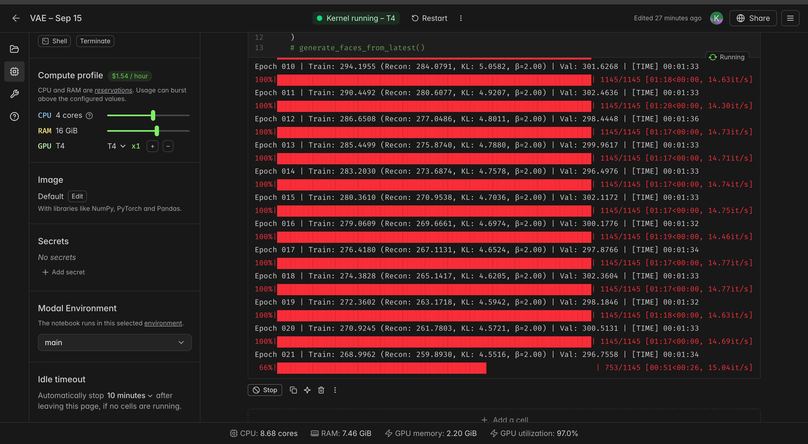
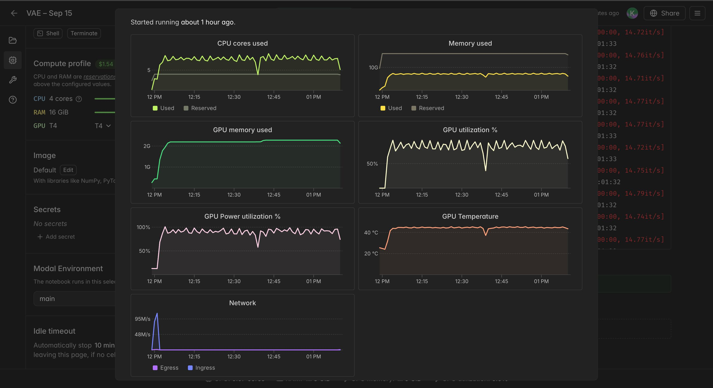

# Media generation

Weights from the training run are uploaded on [HF](https://huggingface.co/kozonhf/uploads/tree/main)

### VAEs

The weights are stored in FP16 due to size limitations on GitHub - halved from FP32 which is the default. The main script
has a `short_run` option to test out the changes by only running over a small number of batches.

Result after training on "flwrlabs/celeba" from HuggingFace for 50 epochs on my local machine (~4 hours on M4 mps):
 

 Tested the script on Modal with GPU specific changes, refer `vae/training.py`. An Nvidia A10G
takes ~1.5 mins per epoch. A T4 GPU also takes a similar amount of time which I later realised since the GPU was not
the bottleneck here. The time might go up or down depending on CPU bursting/availability. The images are not very sharp which is an inherent flaw in vanilla VAEs

#### Learnings from the training runs
The setup was more bounded by compute than GPU, mainly because GPUs on Modal start with a 16GB T4 and the default CPU
core count was 2. GPU memory usage peaked around 3 GB so even the T4 was a massive overkill and the utilisation was < 70% 
because there weren't enough workers and the GPU was sitting idle. Bumping up the core count to 4 fixed the issue resulting
in ~98% utilisation. Ran into some issues with the loss values becoming too large after I increased the latent space dims.
Removed the autocast and other optimisations since the VRAM usage was very low anyway. It went up from ~2.5 GB to 4 GB,
will keep this in mind when I work with larger models. Had to clamp the logvar values for stability since it gets 
exponentiated. This might slightly reduce the initial learning curve but makes the training stable. 

The hardware metrics indicate the RAM was overprovisioned at 16 GB so I bumped it down to 8 GB. Spent some time 
experimenting with the resources to find a sweet spot between cost and performance. I should've added a persistent storage
to avoid redownloading the dataset every time the kernel was restarted after hardware changes, would have saved
a lot of time. I was uploading weights and generated samples to HF after every 20 epochs - the checkpoint and sample 
names are rather verbose as I used LLMs to generate utility functions. The validation loss converges
in ~10-15 epochs and the reduction in training loss is also marginal from that point onwards. The majority of the loss
value is probably because of the background and not the facial structure itself.

The final setup on Modal cost USD 1.35/hour and takes 1.5-2 mins per epoch depending on CPU bursting:
- 4 core CPU
- Nvidia T4 16GB
- 8GB RAM

Spent a total of ~USD 10 experimenting with different setups, restarting training a few times after some stability and hyperparam tweaks.
Had burned USD 30 in free credits last month when I just started using Modal and provisioned an A100 with a lot
of RAM for a simpler version of this training script and let a training run continue overnight after forgetting to 
add persistent storage or an upload workflow. The resulting weights were unavailable for that reason - quite the learning experience.

### GANs (...)

G loss should start w 50% probability of fooling the disc and -ln(0.5) ~= 0.693
D loss should start around -2 * ln(0.5) ~= 1.386
Takes roughly 1 min per epoch on local
Note on non saturating loss
Diff learning rates

### Diffusion (...)