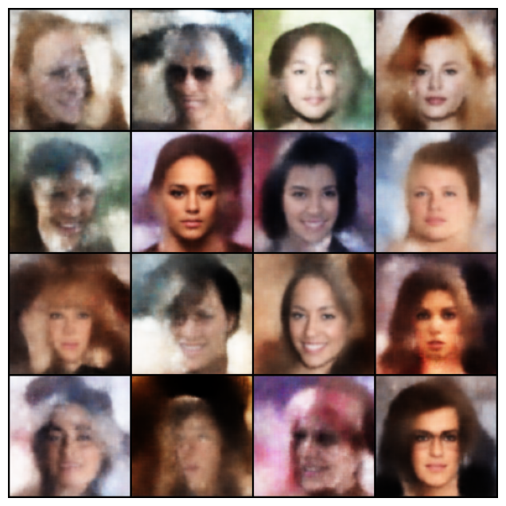

# Media generation

### VAEs

The weights are stored in FP16 due to size limitations on GitHub - halved from FP32 which is the default. The main script
has a `short_run` option to test out pipeline changes by running for one epoch.

Result after training on "flwrlabs/celeba" from HuggingFace for 50 epochs: 

Clearly needs more training. Tested the script on Colab with GPU specific changes, refer `vae/gpu_training.py` 

### GANs (...)

### Diffusion (...)